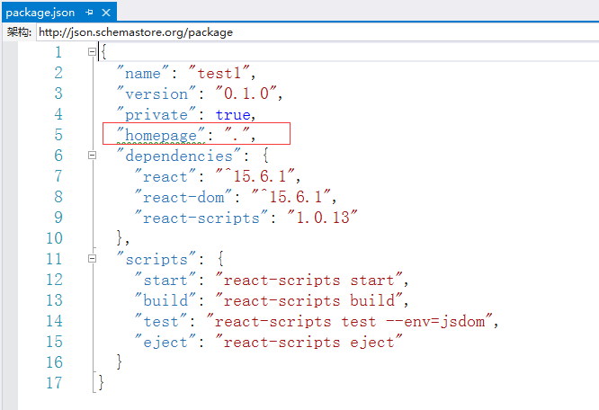

# 编译项目
<br/>

## 简介

本文讲解react项目的编译和发布方法。

<br/>

## 准备工作

1. 按照[开发环境搭建](开发环境搭建.md)中的步骤准备好react开发环境
2. 按照[新建项目](新建项目.md)中的步骤新建项目

<br/>

## 步骤

<br/>

打开package.json文件，添加如下的配置项目：

```json
"homepage": "."
```

如下图所示：



<br/>

在项目路径打开命令窗口，输入以下命令：

```sh
npm run build
```

执行成功后，会创建一个`build`文件夹，进入其中，找到文件`index.html`，使用chrome打开该文件，可以看到网页正常打开。

<br/>

在发布时，只要将`build`文件夹中全部文件复制到发布路径即可。

