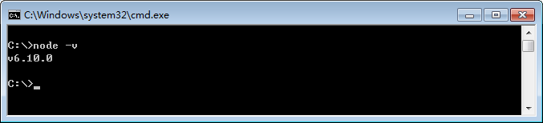
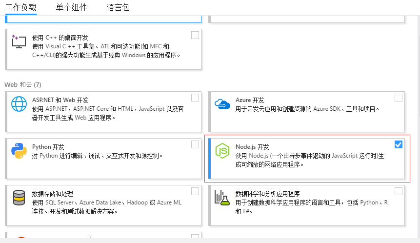
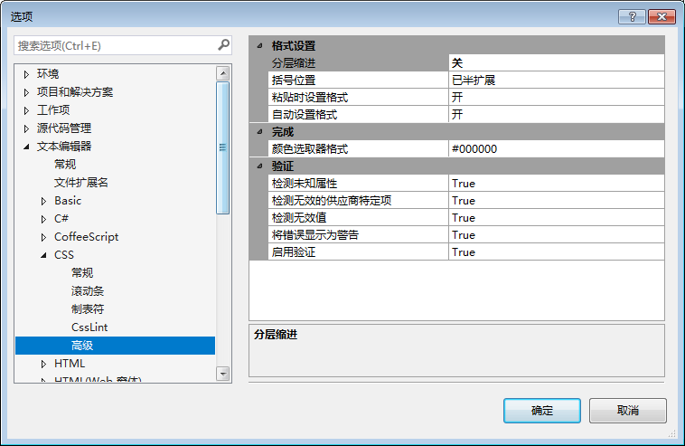

# react开发环境搭建
## 概述

### 简介

本文描述了在一台全新电脑搭建react开发环境的全部过程。

这里，所有例子是在windows操作系统上进行的。本文的操作步骤不适合mac或linux操作系统。

### 关于Node

Node.js是现代工业化前端的基础，为使用其它前端工具提供了必要环境。进行react框架开发时，nodejs是必要的。本文将介绍Node.js的安装和配置方法。

### IDE选择

我们需要选择一种IDE或编码工具，进行react编程开发。前端开发工具有很多种，每个人可根据习惯自由选择。

选择的工具需要对ES6语法、jsx语法进行支持。

本文以visual studio 2017为例，讲解安装和配置方法。


## nodejs

## 下载安装

nodejs下载地址如下：

[下载地址](http://nodejs.cn/download/)

采用默认配置进行安装即可。

安装完成后，打开命令行窗口，输入以下命令检查nodejs是否安装成功

```sh
# 查看node版本
node -v
```




### 使用npm

在安装nodejs时，包管理工具npm会同时被安装。我们使用npm安装一些全局使用的工具。

可以尝试执行以下命令，进行查看

```shell
# 查看npm的版本
npm -v
```


### 修改npm的registry地址

registry地址是指使用npm下载包时的下载地址，一般默认为https://registry.npmjs.org/，可通过以下命令进行查看：

```shell
# 查看npm的registry地址
npm config get registry
```

默认地址下载很慢，因此需执行以下命令修改为国内的镜像地址：

```shell
# 修改npm的registry地址
npm config set registry https://registry.npm.taobao.org
```

修改后，可再次执行查看registry地址的命令，确保完成修改。


### 安装全局包

全局包指的是安装在全局目录的包，一个包在全局安装后，就可以在命令行中直接运行该组件包支持的命令。

可以尝试执行以下命令，查看全局包的相关信息

```shell
# 查看全局包的保存路径
npm root -g

# 查看已经安装的全局包
npm list -g --depth 0
```

依次执行以下命令，安装全局包（命令执行完一个后，再执行下一个）：

```shell
# 全局安装gulp
npm install -g gulp

# 全局安装webpack
npm install -g webpack

# 全局安装react
npm install -g react

# 全局安装create-react-app
npm install -g create-react-app
```


## vs2017

### 下载安装

vs2017下载地址如下：

[下载地址](https://www.visualstudio.com/zh-hans/thank-you-downloading-visual-studio/?sku=Community&rel=15#)

安装时，在工作负载部分勾选“Node.js”，如下图



其它步骤根据向导安装即可。

###选项配置

打开`工具` -> `选项`，依次展开`文本编辑器`、`CSS`、`高级`，将`分层缩进`设置为`关`。



 
