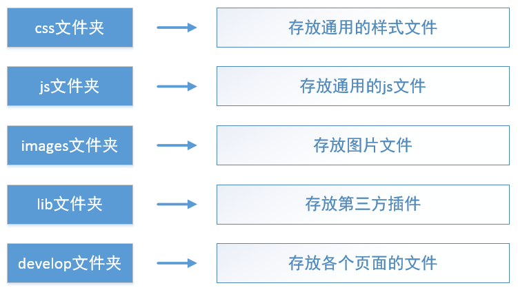
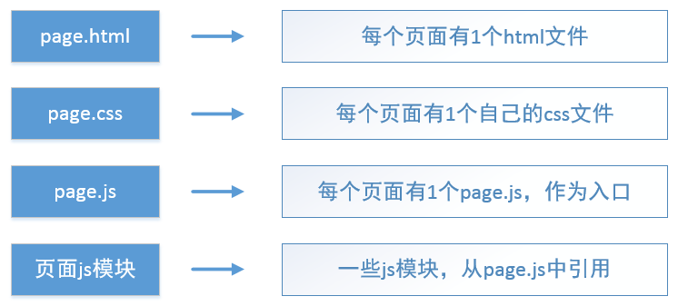

# 代码结构
[1  文件夹](#user-content-1--文件夹)

[2  develop文件夹](#user-content-2--develop文件夹)

[3  页面文件组成](#user-content-3--页面文件组成)

[4  css文件的组织](#user-content-4--css文件的组织)

[5  js文件的组织](#user-content-5--js文件的组织)

[6  第三方插件的引用方式](#user-content-6--第三方插件的引用方式)

##  1  文件夹

主要存在上图描述的五个文件夹。除了一些文件放在根目录下之外，其它代码文件都分别放在上述五个文件夹之内。

##  2  develop文件夹

develops是页面开发文件夹。开发一个新页面，一般来说，只需要在develop中添加内容。在develop文件夹中存放各个页面的代码，而通用性的代码则放在其它地方。

在develop中又划分为很多子文件夹，每个页面的所有文件放在一个文件夹内。如果系统的页面非常多，可能需要多级文件夹结构。

##  3  页面文件组成

我们开发一个页面时，需要创建上图所示的文件。我们一般把这些文件放在同一个文件夹内，这样在开发和修改时容易查找。每个页面包含1个html文件、1个css文件和多个js文件。

我们采用了require.js模块化框架，一个页面的js代码被拆分到多个js文件内，每个js文件是一个模块。在html文件中，只需要引用page.js文件，其它js文件在page.js中，由require.js的加载器动态加载。

##  4  css文件的组织

一般我们会编写一个style.css作为全局样式，放在css文件夹内，所有的页面会引用它。

每个页面拥有自己样式文件，叫做page.css，放在自己的页面文件夹内。

此外，如果一组页面比较相似，则把它们中的公共样式提取出来，形成一个文件，放在css文件夹内。

在页面中引用css文件时需要注意引用的顺序，style.css始终是第一个引用的，page.css始终是最后一个引用，如果有其它css引用，则放在style.css和page.css的中间。

在开发工作中，应及时的把重复的样式提取到通用样式文件中，减少重复代码。

##  5  js文件的组织

通用的js文件放在js文件夹中，页面自己的js文件放在页面文件夹内。在js文件夹中，一般有js/common、js/modules、js/wlib三个子文件夹。其中后两者是存放模块的，js/common中存放非模块js文件。

##  6  第三方插件的引用方式

我们会使用很多第三方的小插件，例如页码插件、日期选择框等，此外还有jquery、extjs4、echarts等大型库。
我们是采用模块化开发框架的，因此应尽可能的把第三方插件当作模块来使用。有些第三方插件，例如jquery、echarts、extjs4，它们本身就是按模块化规范封装的，可以配置后直接当成模块使用； 其它的，也应尽可能的将其按照AMD规范进行封装，转化为我们自己的模块。