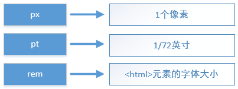

# 响应式布局的实现
[1  基础知识](#user-content-1--基础知识)

　　[1.1  什么是响应式布局](#user-content-11--什么是响应式布局)

　　[1.2  CSS尺寸单位](#user-content-12--CSS尺寸单位)

　　[1.3  pt转px](#user-content-13--pt转px)

[2  rem布局原理](#user-content-2--rem布局原理)

[3  rem.js](#user-content-3--rem.js)

[4  开发方法](#user-content-4--开发方法)

　　[4.1  引用rem.js](#user-content-41--引用rem.js)

　　[4.2  在css中使用rem](#user-content-42--在css中使用rem)

　　[4.3  echarts中的尺寸](#user-content-43--echarts中的尺寸)

　　[4.4  图片的尺寸](#user-content-44--图片的尺寸)

　　[4.5  背景图的尺寸](#user-content-45--背景图的尺寸)

##  1  基础知识

###  1.1  什么是响应式布局

通常所说的“响应式布局”，指一个网站能够兼容多个终端，网页在电脑、手机、平板上均可以良好的展示。

在本文中，概念有所不同。本文所讲的响应式布局，指网页能够适配各种显示器的分辨率，包括台式电脑的外接显示器、笔记本显示器、投影仪等，这里并不讨论手机和平板相关的内容。

我们希望网页可以“正好”铺满屏幕，既不要左右留白，也不要出现水平方向的滚动条。


###  1.2  CSS尺寸单位



在工作中，常用的尺寸单位包括以上三种。

px是最常用的单位，表示像素；

pt是物理尺寸，等于1/72英寸，设计图中字体大小一般用pt描述

rem是css3规定的单位，基于html元素的字体大小；


###  1.3  pt转px

pt是固定尺寸，如果希望在不同的分辨率下字体大小也不同，在需要把pt转化为其它单位。

pt和px的转化较复杂，与屏幕分辨率和屏幕尺寸都由关系。在1920*1080的21.5寸显示器中，1pt=1.423px。在编写css时，不可能做到太过精细。因此，在实际开发工作中，我们认为：

```
1pt ≈ 1px 可根据实际效果自行调整
```

如果设计图中字体是16pt，那么在计算时，可认为是16px，并根据实际效果调整。


##  2  rem布局原理

rem是css3的一种尺寸单位，在IE9等现代浏览器中被支持。rem和px之间可以按照以下规则转换：

```
rem等于<html>元素的font-size大小
假设<html>元素的font-size属性为100px，那么
1rem = 100px
```

下面用一个例子来讲解rem布局的实现原理。

假设我们想要绘制一个input元素，在1920px的屏幕中，宽度为200px，并根据屏幕尺寸自动按比例缩放。例如：

在1600px的屏幕，宽度为200*1600/1920=167px；

在1366px的屏幕，宽度为200*1366/1920=142px；

为了达到该目的，我们在css中将此input元素的宽度设置为2rem，并且通过js，动态的设置<html>元素的font-size，如下：

```javascript
var fontSize = document.documentElement.clientWidth / 19.2;
document.documentElement.style.fontSize = fontSize + 'px'; 
```

第一行代码中，通过document.documentElement获取了html元素，根据其clientWidth属性，即可得知html的宽度，也就是浏览器窗口的宽度，使用这个宽度除以19.2，用fontSize变量保存计算结果；

第二行代码，将html元素的字体大小设置为fontSize（px）

如此，假设浏览器窗口为1920px，那么document.documentElement.clientWidth的值是1920，于是fontSize的值是100，也就是html元素的font-size为100px，根据rem的含义我们知道，1rem=100px。而前面提到的input宽度因为是2rem，所以也就是200px，符合我们的预期；

再假设浏览器窗口为1600px，那么fontSize=1600/19.2=83.3，也就是1rem=83.3px，因此input宽度是2*83.3=167px，依然符合我们预期。

至此我们看得出来，不论浏览器窗口的尺寸如何变化，input元素可以等比例的缩放。


##  3  rem.js

在js文件夹中有一个rem.js文件，所有页面的html文件中，都必须引用该文件。

该文件主要实现了以下几部分内容：

- 设置html元素的font-size属性

```javascript
function setFont() {
    var fontSize = document.documentElement.clientWidth / 19.2;
    document.documentElement.style.fontSize = fontSize + 'px';
}

setFont();

window.onresize = function () {
    setFont();
}
```

在这里，setFont函数实现了根据窗口大小设置html元素字体的功能。setFont会在页面加载后立即执行一次，每当窗口尺寸发生变化时，会再次调用setFont。

- 提供全局的getPx方法

```javascript
 window.getPx = function (designPx) {
     var curr_font = parseFloat(window.document.documentElement.style.fontSize);
     return designPx * curr_font / 100;
 }
```

getPx设置在window对象上，因此是全局的。该方法实现了设计尺寸到实绩尺寸的转化，常用于echarts绘制中。


##  4  开发方法

###  4.1  引用rem.js

所有页面必须引用rem.js，引用的位置是在<body>中的页面元素之后，并放在其它js文件之前。


###  4.2  在css中使用rem

编写css时，除少数1px的尺寸外，其它一律使用rem单位进行编写；

一般来说，美工给的设计图是按照px进行标注的，按照以下公式进行转化：

```javascript
1rem = 100px
```


###  4.3  echarts中的尺寸

在echarts中，尺寸只能以px为单位，无法设置为rem，此时需要用到在rem.js中定义的getPx全局方法。

举例来说，假设某柱状图的柱子宽度在设计中是20px，那么编程时，需进行转化

```javascript
var w = getPx(20);
```

 使用转化后的数值设置。


###  4.4  图片的尺寸

在创建``标签后，必须在css中为其设置宽度和高度。

假设图片的原始尺寸为300*50，那么需在css中设置：

```css
width: 3rem;
height: 0.5rem;
```


###  4.5  背景图的尺寸

在设置div元素的背景图时，需要在css中设置div的尺寸，并将`background-size`设置为两个100%

```css
width: 3rem;
height: 2rem;
background-image: url(bg.png);
background-size: 100% 100%;
```

