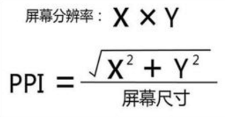
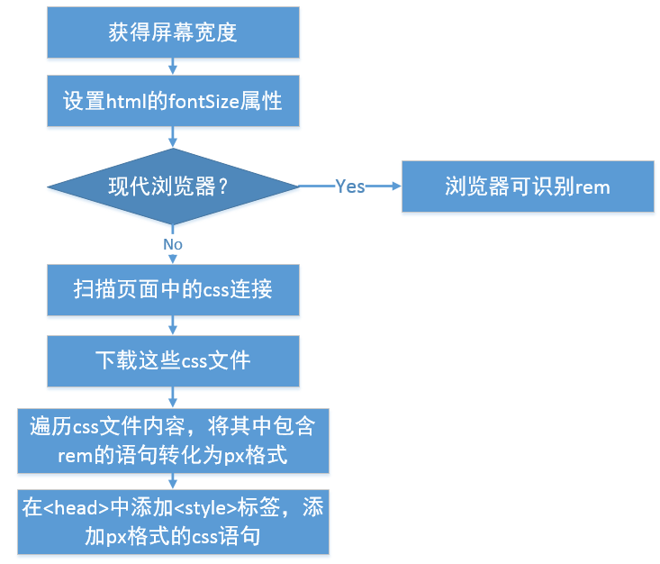
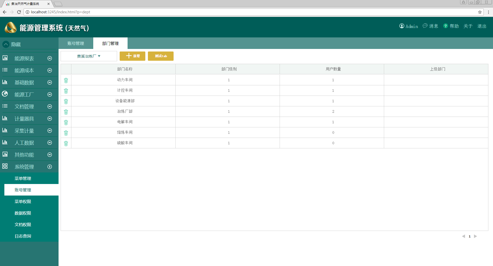
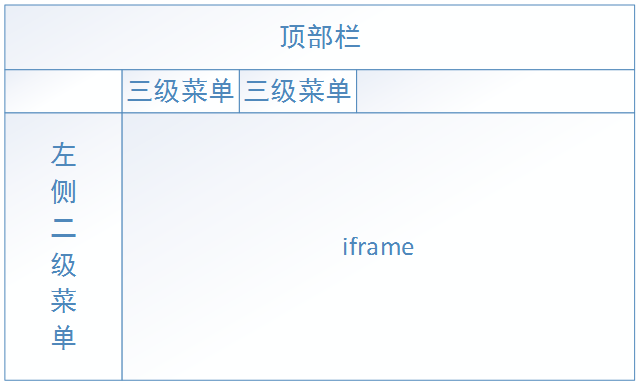
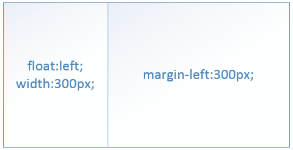
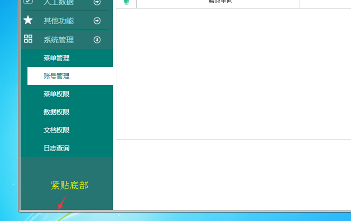
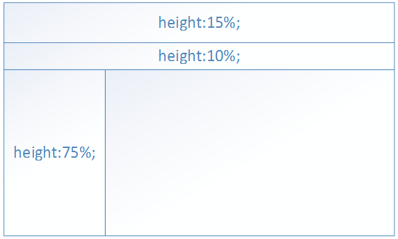
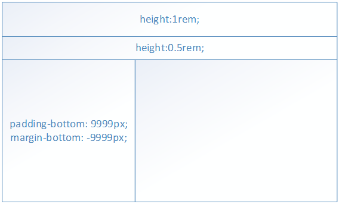

# 响应式布局的实现
[1  基础知识](#user-content-1--基础知识)

　　[1.1  CSS尺寸单位](#user-content-11--CSS尺寸单位)

　　[1.2  pt转px](#user-content-12--pt转px)

　　[1.3  dpi和ppi](#user-content-13--dpi和ppi)

[2  响应式布局的实现思路](#user-content-2--响应式布局的实现思路)

　　[2.1  viewport配合media查询](#user-content-21--viewport配合media查询)

　　[2.2  百分比布局](#user-content-22--百分比布局)

　　[2.3  通过js修改body的class](#user-content-23--通过js修改body的class)

　　[2.4  vw布局](#user-content-24--vw布局)

　　[2.5  rem布局](#user-content-25--rem布局)

[3  rem的实现](#user-content-3--rem的实现)

　　[3.1  rem工作流程](#user-content-31--rem工作流程)

　　[3.2  注意事项](#user-content-32--注意事项)

　　[3.3  闪动问题](#user-content-33--闪动问题)

　　[3.4  图片自适应](#user-content-34--图片自适应)

[4  后台管理网站的最常用布局](#user-content-4--后台管理网站的最常用布局)

　　[4.1  布局分解](#user-content-41--布局分解)

　　[4.2  两列布局](#user-content-42--两列布局)

　　[4.3  iframe的宽度和高度](#user-content-43--iframe的宽度和高度)

　　[4.4  让div贴住窗口底部](#user-content-44--让div贴住窗口底部)

##  1  基础知识

###  1.1  CSS尺寸单位


CSS常用的尺寸单位如上图所示。

其中px是最常见的，所有浏览器都支持；pt是个物理尺寸，等于1/72英寸，在设计图中常用于描述字体大小；

em是基于字体的尺寸单位，如果某元素font-size是16px，那么1em=16px，在页面内不同的地方，1em是不相同的；

rem是基于html元素的字体大小，如果<html>的font-size是16px，那么页面内所有地方1rem=16px；

vw是浏览器窗口宽度的1/100。

其中rem和vm是CSS3的单位，在IE8之下是不支持的。


###  1.2  pt转px

pt和px的转化较复杂，与屏幕分辨率和屏幕尺寸都由关系。在1920*1080的21.5寸显示器中，1pt=1.423px。在编写css时，不可能做到太过精细。因此，在实际开发工作中，我们认为：

```
1pt ≈ 1px 可根据实际效果自行调整
```

如果美工给的设计中字体是16pt，那么在计算时，可认为是16px，并根据实际效果调整。

###  1.3  dpi和ppi



上面是ppi的计算公式，例如在1920*1080的21.5寸显示器中，PPI = 102.46。

一般我们认为dpi就是ppi。


##  2  响应式布局的实现思路

响应式布局是指一个网站能够兼容多个终端，为不同终端的用户提供更加舒适的界面和更好的用户体验。这个概念常用于移动端的Web开发中，在PC端的网页一般采用固定尺寸。考虑我们开发系统的特点，基本是后台网站性质的，CURD操作多，交互性强，适合采用响应式布局。


###  2.1  viewport配合media查询

```html
<meta name="viewport" content="width=device-width, initial-scale=1, user-scalable=no" />
```

```css
@media screen and (max-width:1600px) {
.nav { width:100px;}
.nav li { margin-left:8px;}
}

@media screen and (max-width:1900px) {
.nav { width: 120px; }
.nav li { margin-left: 10px; }
}
```

media查询的原理是通过 `@media` 语句判断屏幕尺寸，在不同尺寸的屏幕上应用不同的css。
media查询是CSS3的语法，IE8以下不支持，可以考虑引用css3-mediaqueries-js或respond.js来解决。


###  2.2  百分比布局

在水平方向，元素采用百分比宽度，与min-width和max-width配合；在垂直方向使用固定px高度。

也可能采用固定列+动态列的方式，某些列采用固定px的宽度，为其它的列按照百分比分配剩余宽度值。

该方式实现和维护是最简单的，但有一个比较明显的缺点：元素的宽高比在不同分辨率下会不一致。


###  2.3  通过js修改body的class

在js中判断屏幕尺寸，根据宽度的区间给body添加class，例如：

```html
<body class="w1600">
```

在css中添加前缀：

```css
.w1600 .nav { width: 100px; }
.w1600 .nav li { margin-left: 8px; }

.w1900 .nav { width: 120px; }
.w1900 .nav li { margin-left: 10px; }
```


###  2.4  vw布局

一个vw是1/100浏览器宽度。表面看来，vw是最适合响应式布局的，但vw兼容性比较差，因此实际项目中使用的很少。


###  2.5  rem布局

vw能做到的，rem也基本能做到，而rem的兼容性比vw要好不少，因此被应用的也更多一些。例如淘宝手机网页版就是使用rem技术进行响应式布局的。


##  3  rem的实现

我们选择rem技术作为响应式布局的实现方案。


###  3.1  rem工作流程




上图展示了rem布局的工作流程。

在IE9以上和其它现代浏览器中，实现是比较简单的。通过js获取屏幕宽度值w，并将html元素的fontSize属性设置为w/19.2。这里取19.2的原因是美工的设计图是按照1920px制作的，而1920/19.2=100，也就是1rem=100px，把设计图中的尺寸除以100即可。举例来说，假如设计图给出某个尺寸300px，那么我们在css中编写为3rem。

如果是IE8或更低版本，则比较复杂。IE8是不识别rem的，需要通过js将rem转化为px。首先扫描html文档，寻找 `<link href="……" rel="stylesheet" type="text/css" />` 格式的标签，通过ajax下载这些css文件，并遍历它们的内容。凡是包含rem的语句，都转化为px值，形成新的样式语句。在html中添加<style>标签，把这些样式添加到里面。


###  3.2  注意事项

- 需引用rem.js

在rem.js中实现了上一小节中描述的流程，必须引用rem.js才能使rem布局生效。引用位置要放在body中，在所有元素的后面，在其它js文件之前。

- 不要在html文件内写样式

在html中编写的rem尺寸，在IE8以下是无法识别的。

- 不要通过js设置rem尺寸

通过js设置的rem尺寸，在IE8以下是无法识别的。正确的做法是定义一个转换函数（这个函数写在rem.js中了，可以直接使用）：

```javascript
window.getPx = function (designPx) {
var curr_font = parseFloat(window.top.document.documentElement.style.fontSize);
return designPx * curr_font / 100;
}
```

通过调用全局函数getPx，把设计尺寸转化为响应式的尺寸。

###  3.3  闪动问题

当页面加载比较慢时，可以看到页面中元素一开始非常小，缩在页面的左上角，一闪之后恢复正常。这是因为在最开始，html的字体是浏览器默认的，一般为16px，因此最开始1rem=16px，所有元素会很小。等rem.js加载完成后才恢复正常。

解决方法是通过css将body设置为隐藏，在rem.js中把html的fontSize设置完成后，再将body显示出来。

```css
/* 在css中 */
body { visibility:collapse;}
```

```javascript
// 在rem.js中
document.body.style.visibility = 'visible';
```

###  3.4  图片自适应

对于固定的图片，只需要创建img标签，并在css中把它的width和height设置为rem格式即可，浏览器会自动根据我们设置的尺寸拉伸图片。

这里需要注意的是，如果把图片放大了，会出现模糊。因此美工给我们的切图都是按照最大尺寸1920*1080设计的。

对于非固定图片，我们会创建一个html元素，在css中设置它的背景图片。

```css
background-image:url(images/test.png);
background-size:100% 100%;
```

注意我们设置了background-size: 100% 100%，这行语句可以实现背景图片的拉伸。

在ie7和ie8中是不支持background-size的，采用滤镜和css hack技术：

```css
background-image: none\9;
background-repeat: no-repeat\9;
filter: progid:DXImageTransform.Microsoft.AlphaImageLoader(src='images/test.png', sizingMethod='scale')\9;
```

这三行代码以“\9”结束，表示仅对IE8和IE8以下的IE浏览器生效。这几行代码通过滤镜实现了背景图拉伸效果。

##  4  后台管理网站的最常用布局



上图是在一种比较常见的后台管理类型网站的布局方式。

###  4.1  布局分解

我们将页面进行分解，形成下图：



系统支持三级菜单，在左侧实现了二级菜单；点击进入二级菜单后，将它的三级菜单横排在页面的中上部分。

一个三级菜单对应一个功能页面，在右下部分的iframe中加载。


###  4.2  两列布局



左侧的菜单栏和右面的iframe区域是一个典型的两列布局。所谓的两列布局，大多情况下，其中一列是固定宽度的，另一列填充剩余的宽度。其中固定列采用定宽浮动，另外一列使用margin。


###  4.3  iframe的宽度和高度

iframe的宽度是比较简单的，设置width属性为100%即可。 而iframe的高度设置100%是比较困难的。

目前我们采用js设置法，在iframe的load事件中，获取其中内容的高度，以此来设置iframe的高度。这样做会出现一个问题，刚开始iframe高度会比较小，等其中内容加载结束后会增加高度，视觉上会感到闪动。目前解决思路是在加载前让iframe隐藏，加载后再显示出来。


###  4.4  让div贴住窗口底部

现在考虑一下左侧菜单栏的样式，它是有背景色的，我们希望它的底端能紧贴浏览器的底端，不要留出缝隙。



使用固定高度是不可以的，每个客户的浏览器可视窗口的高度是不相同的，无法做到准确的匹配。高度设小了，在底部会出现一个白色的横条；高度设大了，会出现不必要的垂直滚动条。

一种解决方案是使用100%高度法，把html、body的高度设为100%，再把页面中每一部分按照百分比高度进行设置，如下图所示：



这种方式存在一个问题，布局中每一块的高度都是不确定的，导致下一级的元素定位很复杂，垂直居中实现变的很麻烦，整个页面编写难度加大。因此，一般不推荐使用百分比尺寸来编写样式。

另一种解决方案是比较主流的办法，使用margin-bottom和padding-bottom并设置很大的数字。



不论浏览器窗口尺寸如何，页面始终填满窗口的高度，而且不会出现滚动条。


