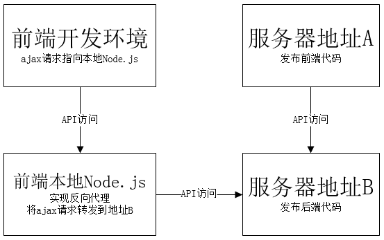

# 前端开发与部署方案
[1  前端开发](#user-content-1--前端开发)

[2  前端部署](#user-content-2--前端部署)

[3  前端代码管理](#user-content-3--前端代码管理)

##  1  前端开发

上面图形展示了前端开发环境的结构。可以看到，我们在`服务器地址B`上部署了后台，因此，在前端开发者本地电脑中，不要安装JRE或数据库等后端环境，直接请求服务器即可。

在js代码中，所有ajax请求使用相对路径，类似`api/user/list`这种。开发调试时，在本地运行一个localhost环境，因此ajax请求就会指向到`localhost:xxxx/api/user/list`了。

这时，我们通过反向代理，把ajax请求转发到`服务器地址B`上面，地址变更为`服务器地址B/api/user/list`。这样，可以在本地跑通整个系统。

此外，我们还要定期将前端代码发布到`服务器地址A`中，这样，项目组其它人员可以使用浏览器打开`服务器地址A`了解开发进度。

##  2  前端部署

在前端，仅提供常规的html、css、js代码，暂不考虑任何服务端预处理。

因此，前端的部署是非常简单的，只需要把全部代码拷贝到某个地址即可，无需任何额外配置。

##  3  前端代码管理

为了减少彼此影响，前端使用独立的代码仓库，与后台代码没有任何关联。

