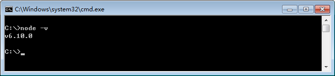
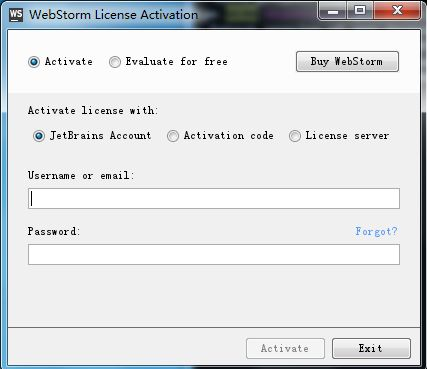

# 开发环境搭建
## 概述

### 操作系统

本文描述了在一台全新电脑搭建开发环境的全部过程。这里，所有例子是在windows操作系统上进行的。本文的操作步骤不适合mac或linux操作系统。

### Node

Node.js是现代工业化前端的基础，为使用其它前端工具提供了必要环境。本文将介绍Node.js的安装和配置方法。


下面这一段放在这里不合适，需要移植

基于Node.js的工具主要包括：

- 包管理工具，如`npm`、`bower`、`yarn`等

  安装和管理第三方库，我们选择nodejs自带的`npm`

- 自动构建工具，如`gulp`、`grunt`等

  合并、压缩css、js，编译sass、less等，我们选择`gulp`

- 模块预编译工具，如`webpack`、`browserify`等

  将开发时编写的多个模块编译成一个模块，我们选择`webpack`

- MVVM框架，如`react`、`angularjs`、`vue.js`等

  MVVM是一种管理与组织代码的方式，实现了页面视图和数据Model的单向或双向绑定，目的是将开发人员的精力集中在业务和数据上，减少对页面元素的处理。我们选择`react`

本文将分别介绍上述工具的安装和配置方法。


### IDE

前端开发工具有很多种，可根据习惯只有选择。本文以webstorm为例，讲解其安装和配置方法。


## nodejs

## 下载安装

nodejs下载地址如下：

[下载地址](http://nodejs.cn/download/)

采用默认配置进行安装即可。

安装完成后，打开命令行窗口，输入以下命令检查nodejs是否安装成功

```sh
# 查看node版本
node -v
```




### 使用npm

在安装nodejs时，包管理工具npm会同时被安装。我们使用npm安装一些全局使用的工具。

可以尝试执行以下命令，进行查看

```shell
# 查看npm的版本
npm -v
```


### 修改npm的registry地址

registry地址是指使用npm下载包时的下载地址，一般默认为https://registry.npmjs.org/，可通过以下命令进行查看：

```shell
# 查看npm的registry地址
npm config get registry
```

默认地址下载很慢，因此需执行以下命令修改为国内的镜像地址：

```shell
# 修改npm的registry地址
npm config set registry https://registry.npm.taobao.org
```

修改后，可再次执行查看registry地址的命令，确保完成修改。


### 安装全局包

全局包指的是安装在全局目录的包，一个包在全局安装后，就可以在命令行中直接运行该组件包支持的命令。

可以尝试执行以下命令，查看全局包的相关信息

```shell
# 查看全局包的保存路径
npm root -g

# 查看已经安装的全局包
npm list -g --depth 0
```

依次执行以下命令，安装全局包（命令执行完一个后，再执行下一个）：

```shell
# 全局安装gulp
npm install -g gulp

# 全局安装webpack
npm install -g webpack

# 全局安装react
npm install -g react

# 全局安装create-react-app
npm install -g create-react-app
```


## webstorm

### 下载安装

windows版本的webstorm下载地址如下：

[下载地址](https://download.jetbrains.8686c.com/webstorm/WebStorm-2017.2.2.exe)

采用默认配置进行安装。

### 破解激活

首次运行时需要进行激活，如下图：



切换到License server，然后填写下面的激活码。

```shell
http://idea.iteblog.com/key.php
```

即可激活成功。


