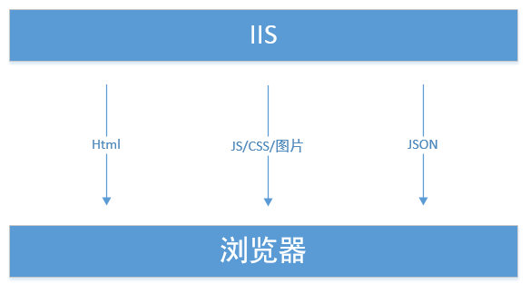
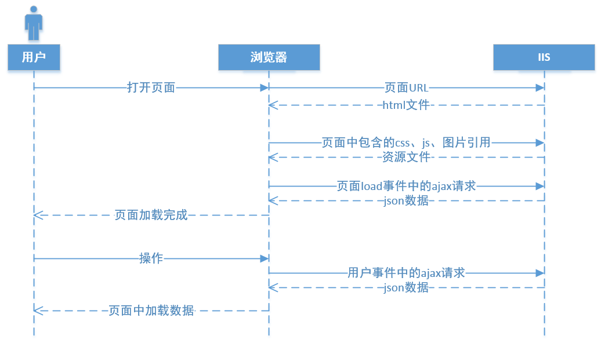
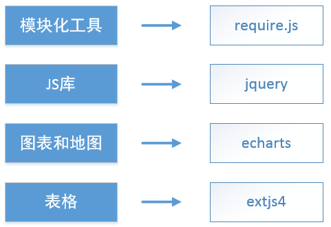
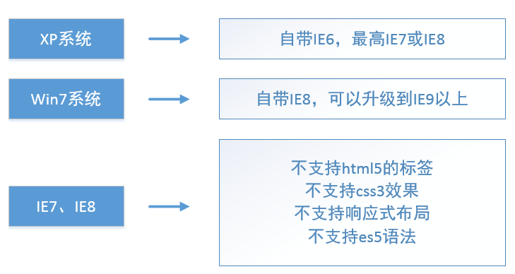

# 概述
[1  系统架构](#user-content-1--系统架构)

[2  页面加载流程](#user-content-2--页面加载流程)

[3  技术和框架](#user-content-3--技术和框架)

[4  兼容性要求](#user-content-4--兼容性要求)

[5  响应式布局要求](#user-content-5--响应式布局要求)

##  1  系统架构

当服务端使用.net时，采用IIS作为Web Server；服务端使用java时，采用apache作为Web Server。

在Web Server中保存了一些静态资源，例如Html、JS、CSS、图片、音频视频等文件，通过URL访问；此外，Web Server还需要提供Restful风格的API，在页面中通过ajax技术调用。

##  2  页面加载流程

用户在浏览器中打开页面后，向IIS发起一个页面请求。IIS根据请求页面的路径，找到html文件并返回。在浏览器中加载html文件，之后异步的向服务器请求js、css、图片等文件。

页面加载完成后，会触发load事件中，一般是 `body` 的 `onload` 函数；如果采用jquery框架，则是 `$(function(){})` 函数。在load事件中，我们发起一些ajax请求来从服务器获取数据，动态的渲染页面。比如获得下拉框的数据源，从而给 `select` 元素添加 `option` ；或者获得树状结构的数据，以便添加树状图的节点，等等。

当用户在页面中进行操作时，会触发一些页面事件，调用绑定在这些事件上的js函数，无刷新的更新页面内容。在这些用户事件中，有时会通过ajax异步请求数据，加载到页面中。

##  3  技术和框架

使用require.js作为模块化工具，进行“面向模块”的编程。一个模块就是实现特定功能的文件。有了模块，我们就可以更方便地使用别人的代码，想要什么功能，就加载什么模块。而require.js描述了一套js模块化的规范。

jquery是一个js函数库，帮助我们更容易的编写跨浏览器的js代码。我们使用jquery，主要用于编写dom操作、ajax请求、事件绑定等。

echarts是百度的图表库，通过简单的配置来绘制图表和地图。其原理是h5的canvas和IE的vml，可以兼容低版本的IE。

extjs4是一个比较重的js框架，我们没有用到它太多的功能，只用到Ext的 `Store` 类和 `Grid` 类来绘制表格。

##  4  兼容性要求

在我们的客户中，仍有不少IE8的使用者，以及少量的IE7使用者。至少目前来说，我们的系统仍然需要对IE8的支持。

在IE7和IE8中，主要存在着以下的问题：

- 不支持html5

Html5的canvas标签无法识别，无法使用canvas制作管网图和其他图形效果

- 不支持css3

IE8以前仅支持css2.1，不支持css3的新特性，例如圆角、阴影、透明度、背景图片拉伸等

- 不支持常见响应式布局

常见的响应式布局方式，例如@media媒体查询，rem布局以及vw布局等，都是不支持IE8的

- 不支持ES5语法

这里ES指的是EcmaScript，它是JavaScript中的基本语法。在IE8以前，仅支持ES3，不支持ES5中的新语法，例如  `JSON` 对象，`indexOf` 方法等。如果在代码中使用了这些语法，在IE8中会出错

- 其他兼容性问题

在现代浏览器中运行良好的页面，在IE7、IE8中可能出现布局错误，或者js报错现象。这些问题在实际开发中经常遇到，需要逐渐积累经验才可以避免

##  5  响应式布局要求

我们的网站采用响应式布局，也就是说，页面应该铺满整个屏幕，而且当水平分辨率大于某数值（一般是1280px）时不出现水平滚动条。在不同的分辨率下，页面看起来应该是基本一致的。在任何分辨率下，包括用户使用Ctrl+鼠标滚轮调整页面大小的情况，应保证布局不乱。

