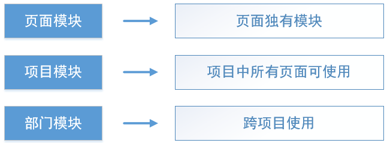

# 模块化
[1  require.js工作流程](#user-content-1--require.js工作流程)

[2  js模块是什么](#user-content-2--js模块是什么)

[3  模块化编程的目的](#user-content-3--模块化编程的目的)

[4  模块的组织](#user-content-4--模块的组织)

[5  模块的设计原则](#user-content-5--模块的设计原则)

##  1  require.js工作流程

```javascript
<script src="/js/require-2.1.11.js" data-main="/develop/company/company-device/page"></script>
```
这是引用require.js框架的代码。通过一个script标签引用require.js文件，这个标签还有一个data-main特性。

require.js是模块化的一种实现，在html中引用require.js，并自动加载data-main路径指向的js文件。

模块化是一种js编程思想，在2011年左右开始兴起。它的思路是，在html中只引用模块化工具文件（require.js)和入口js文件（data-main指定），其他的js文件通过代码来动态添加。

```javascript
var $ = require('jquery');    //  引用jquery模块
var dao = require('dao');     //  引用数据获取模块
var pagin1 = require('pagin');    // 引用分页模块
var bubble = require('bubble');  // 引用全局事件管理模块
var chart1= require('chart1');  // 引用图表模块
```

这里通过require函数，依次引用了5个模块。

##  2  js模块是什么

一个js模块是一个文件，在其中定义一个对象，并对外公开。在其它js代码中，只能看到这个对象以及对象的方法，而看不到其内部的实现细节。

具体到require.js框架内，一个js模块中需要执行define(…)函数，在这个函数中传入一个函数类型的参数。

```javascript
define(function () {
    var obj = { x: 5 };
    return obj;
})
```

上面的代码我们定义了一个最简单的模块，这个模块输出一个对象obj，它只有一个属性x。

假设我们把这个简单模块取名为test.js，那么在其它js文件中，可以通过require函数来引用它：

```javascript
var test = require('test');
test.x; // 5
```

引用一个模块时，返回这个模块的输出对象。

##  3  模块化编程的目的

- 封装

Javascript中是没有“类”的概念的，为了编写松耦合的代码，我们采用模块化框架来实现。每个模块仅输出一个对象，在外面可以看到这个对象公有的属性和方法，而看不到其具体实现和私有变量。这正是面向对象编程中“封装”的思想。

- 复用

模块化编程的另一个重要目的是复用。将某个代码块封装为模块后，在任何页面都可以简单的使用require函数来使用这个模块，甚至可以做到跨项目复用。

##  4  模块的组织

按照使用范围，我们把模块分为三类：



- 页面模块

属于某个页面，只能被这个页面调用，不具有重用性

- 项目模块

在项目内使用，可以在项目内多个页面中重用

- 部门模块

在部门组件库中维护，在任何项目中均可使用，需要进行版本控制

以上三种js模块的文件位置也是不同的，页面模块放在develop内的页面文件夹内，项目模块放在js/modules中，部门模块的源文件是在github中，使用时复制到项目的js/wlib目录下。

##  5  模块的设计原则

- 一个模块，只做一件事，并把这件事做好

这就是单一职责原则，是面向对象的低耦合、高内聚原理。将职责定义为引起变化的原因，以提高内聚性来减少引起变化的原因。职责过多，可能引起它变化的原因就越多，这将导致职责依赖，相互之间就产生影响，从而极大的损伤其内聚性和耦合度。单一职责，通常意味着单一的功能，因此不要为一个模块实现过多的功能点，以保证实体只有一个引起它变化的原因。

- 伸手要数据，避免自己拿数据

如果一个模块需要数据，则应该编写一个接收数据的方法，而不是在模块内部自己去取。例如，有一个菜单模块menu.js，它需要页面列表数据来绘制菜单。那么，在menu.js中写一个receive(data)方法，由外部代码把数据给它，而不是在menu.js中去写ajax一类的代码来获取数据。对于一个菜单模块，它不需要知道数据访问的流程。直接把数据给它即可，让它知道尽可能少的事情。

- 公开事件，而非处理事件

考虑如下的场景：我们编写一个chart.js模块来绘制柱状图，编写win.js模块来打开一个弹出窗。当用户点击了柱状图中的柱子时，需要打开弹出窗显示这个柱子的一些详细数据。对于chart来说，它的作用是绘制柱状图，chart不应该知道win的存在。因此，我们需要为chart添加一个barClick方法，来公开柱子点击事件。在外部调用该方法，并编写它的事件处理。

```javascript
// 在模块外部绑定事件的处理函数
var chart = require('chart');
var win = require('win');
chart.barClick(function (barId, barName) {
    win.open();
})
```

chart只是负责告诉别人“我的柱子可以点击”，至于点击柱子后发生什么，chart自己是不关心的，它只需要把柱子Id、名称等事件信息公开即可。

- 最佳模块大小

模块分解的越彻底，每一块就越小，全局复杂度和受bug影响的程度也会相应降低。

然而，也可能因为过度划分造成模块过小。模块小时，几乎所有复杂度都在于接口：想要理解任何一部分代码前必须理解全部代码，因此阅读代码非常困难。

有研究发现，200～400逻辑行的代码是“最佳点”，可能的bug密度达到最小。根据经验，逻辑行和物理行之间为两倍的折算率，即每个模块的最佳物理函数建议应在400至800行之间。


