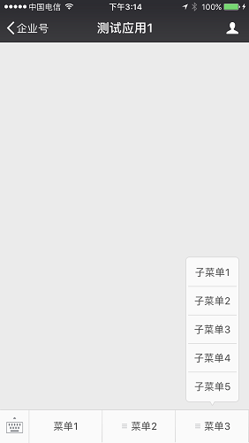

# 移动端开发
[1  移动端web开发](#user-content-1--移动端web开发)

　　[1.1  判断客户端类型](#user-content-11--判断客户端类型)

　　[1.2  兼容性问题](#user-content-12--兼容性问题)

　　[1.3  自适应屏幕尺寸](#user-content-13--自适应屏幕尺寸)

[2  手机app开发](#user-content-2--手机app开发)

　　[2.1  手机app的优势](#user-content-21--手机app的优势)

　　[2.2  手机app开发模式](#user-content-22--手机app开发模式)

　　[2.3  手机app推送原理](#user-content-23--手机app推送原理)

[3  微信企业号](#user-content-3--微信企业号)

　　[3.1  微信企业号的功能](#user-content-31--微信企业号的功能)

　　[3.2  微信企业号开发步骤](#user-content-32--微信企业号开发步骤)

　　[3.3  微信企业号推送原理](#user-content-33--微信企业号推送原理)

##  1  移动端web开发

手机web开发是指用户通过手机浏览器打开系统网站，使用系统功能。

###  1.1  判断客户端类型

如果我们的网站需要同时支持电脑、手机、ipad的访问，则需要至少开发两套页面代码。用户访问网站时，通过js代码判断客户端类型。电脑端返回普通的页面，手机和ipad返回移动端专用页面。

###  1.2  兼容性问题

苹果手机和安卓5以上的手机，对HTML5是支持较好的；对于安卓5以下的手机，也可通过安装第三方浏览器来支持HTML5。我们认为，在移动端web开发时，可以认为客户浏览器是支持Html5、CSS3和ES5的语法的。

###  1.3  自适应屏幕尺寸

移动端web开发的一个重要困难是自适应屏幕尺寸的问题。不同的手机、平板尺寸和分辨率差别很大，需要通过响应式布局技术解决。

##  2  手机app开发

另一种移动端开发模式是手机app，用户下载我们编译生成的apk文件（安卓手机）和ipa文件（苹果手机），并安装应用。

###  2.1  手机app的优势

手机app可以带给客户更快的访问速度和更流畅的操作体验，还可以给客户推送通知，这些是移动web不具备的优势。

###  2.2  手机app开发模式

手机app开发分为原生开发模式和Hybrid开发模式。前者使用java或objective-c语言进行原生开发；后者通过HTML5语言开发。

考虑开发和维护成本，我们选择Hybrid模式。目前有一些免费的开发平台，例如Cordova、APPCan、DCloud、ApiCloud、Wex5等。开发人员通过Html5语言进行开发，通过上述的平台生成安卓和苹果端的安装包。

###  2.3  手机app推送原理

手机app的一个重要功能是推送。我们可以通过推送功能，让用户第一时间掌握系统的报警信息。

安卓和ios的推送原理有所不同。安卓app允许在后台运行，可以在安卓app与推送服务器建立长连接，通过长连接进行推送。

ios操作系统不允许app后台运行，长连接或心跳都是不可行的，需要通过苹果官方提供的APNS服务实现推送。

实际上，有很多成熟的第三方推送服务方，可以帮助我们方便的实现推送功能。

##  3  微信企业号

第三种移动端的开发模式是微信公众平台开发，具体来说，是微信企业号。微信企业号是微信推出的面向企业级市场的产品，依托于微信平台，建立在微信整体架构和关系链之上，为企业/组织服务的连接平台。

同一个营业执照可以注册5个企业号，每个企业号中可以绑定约30个企业应用。

需要客户开通自己的微信企业帐号，并创建一个企业应用，提供给我们，用于系统接入。

###  3.1  微信企业号的功能

微信企业号主要包括以下的功能：

- 消息推送

微信企业号以普通会话的行事存在，可以收发消息。用户使用微信关注企业号后，就可以在微信中收到企业应用的推送消息。

- 功能菜单

可以在企业号中自定义菜单。在每个企业应用中，可以最多创建三个一级菜单，每个一级菜单下面，可最多创建五个二级菜单。

点击菜单按钮后，可进行多种操作：

(1) 跳转至某个URL，在微信中浏览网页

(2) 发送一段消息

(3) 调起微信的扫一扫工具，扫描二维码，将扫码的结果传给业务服务器做处理

(3) 调起系统相机，完成拍照操作后，会将拍摄的相片发送给业务服务器做处理

###  3.2  微信企业号开发步骤

(1) 由客户申请微信企业号，员工关注该企业号

(2) 由客户在企业微信管理平台中，创建一个企业应用，将企业应用的Id和密钥等信息告知开发人员

(3) 由开发人员进行后续功能的开发

###  3.3  微信企业号推送原理

应用系统需要发出推送时，调用微信公众平台的接口，请求推送。由微信公众平台将消息转发到用户的微信客户端中。 

可以对接收信息的人员进行配置，不同人员会接收到不同类型的推送消息。